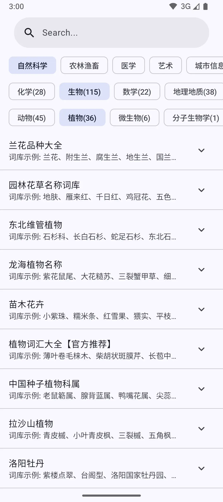
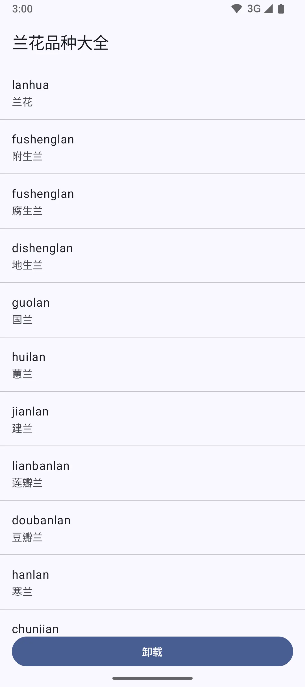
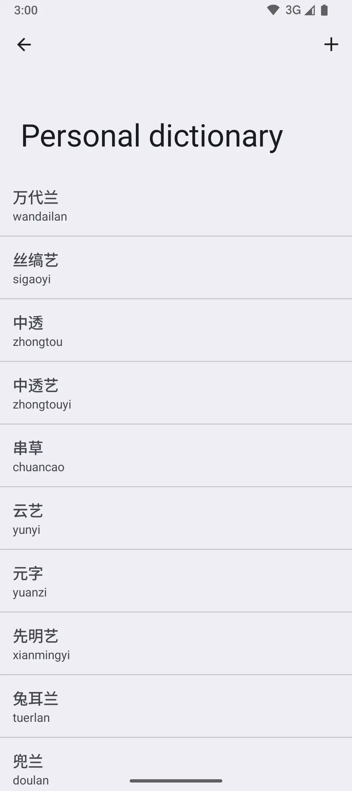

# 词典管理器

一个安卓端的词典管理器应用，支持管理多个来源的词库(搜狗输入法词库、百度输入法词库、QQ输入法词库)。

**本项目旨在解决 Gboard 或其他依赖 UserDictionary 的安卓输入法在中文词库匮乏时的问题。**

---

## 📸 截图

   
   
   

   
   
   

---

## 📥 安装

1. 从 [releases 页面](https://github.com/halifox/DictionaryManager/releases) 下载最新的 APK 文件。
2. 在您的设备上启用 “安装来自未知来源的应用”。
3. 点击下载的 APK 文件进行安装。

---

## 🤝 贡献

我们欢迎任何形式的社区贡献！

---

## 📜 许可证

本项目遵循 [GPL-3.0 License](LICENSE)。

---

## 🙏 致谢

## 📢 法律声明

本开源项目仅供学习和交流用途。由于可能涉及专利或版权相关内容，请在使用前确保已充分理解相关法律法规。未经授权，
**请勿将本工具用于商业用途或进行任何形式的传播**。

本项目的所有代码和相关内容仅供个人技术学习与参考，任何使用产生的法律责任由使用者自行承担。

感谢您的理解与支持。