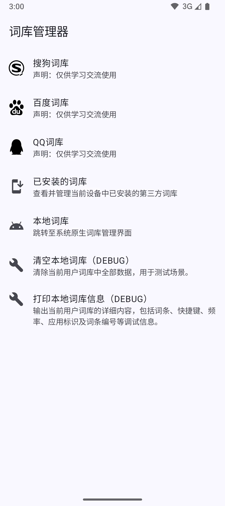
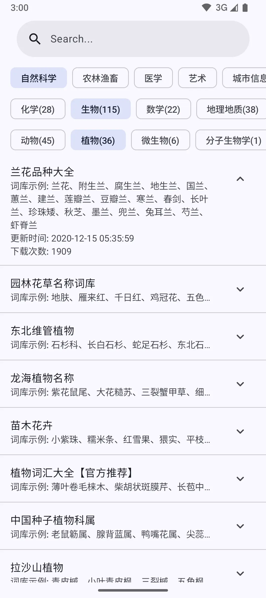
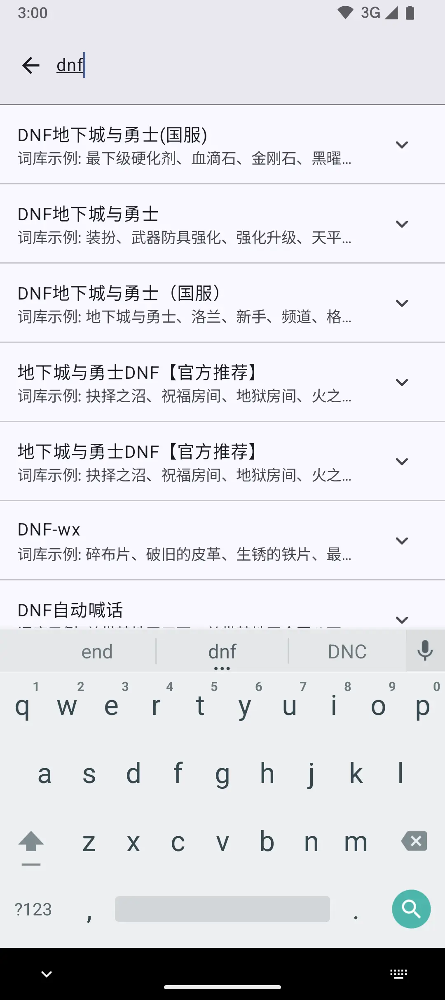

# 📘 词典管理器 Dictionary Manager

一个 🧠 **安卓端词典工具**，支持从多个来源 **在线获取中文词库**，一键下载 📥、解析 🔍 并导入至系统词典
📚，增强 Gboard 等输入法的中文词汇体验。

---

## 🚀 功能特性

- 🌐 在线获取多来源词库
- ⬇️ 快速下载词库文件
- 🔍 高效解析多格式词库
- 📤 一键导入系统词典
- 🎨 简洁流畅的 Compose UI
- 🔐 无需 root，纯净无广告

---

## 📂 支持来源

| 来源平台                     | 下载 | 解析 | 导入 |
|--------------------------|----|----|----|
| 搜狗输入法                    | ✅  | ✅  | ✅  |
| 百度输入法                    | ✅  | ✅  | ✅  |
| QQ输入法                    | ✅  | ✅  | ✅  |
| Chinese-pyim (Linux)     | 🚧 | 🚧 | 🚧 |
| FIT 输入法 (Mac)            | 🚧 | 🚧 | 🚧 |
| libpinyin (Linux)        | 🚧 | 🚧 | 🚧 |
| MacOS 自带简体拼音             | 🚧 | 🚧 | 🚧 |
| QQ 拼音（文本词库和 qpyd）        | 🚧 | 🚧 | 🚧 |
| QQ 五笔                    | 🚧 | 🚧 | 🚧 |
| Rime 输入法 (Linux/Win/Mac) | 🚧 | 🚧 | 🚧 |
| Win10 微软拼音               | 🚧 | 🚧 | 🚧 |
| Win10 微软五笔               | 🚧 | 🚧 | 🚧 |
| 百度拼音 PC（文本词库、bdict）      | 🚧 | 🚧 | 🚧 |
| 必应输入法                    | 🚧 | 🚧 | 🚧 |
| 仓颉平台                     | 🚧 | 🚧 | 🚧 |
| 谷歌拼音                     | 🚧 | 🚧 | 🚧 |
| 极点五笔                     | 🚧 | 🚧 | 🚧 |
| 极点郑码                     | 🚧 | 🚧 | 🚧 |
| 灵格斯词库 ld2                | 🚧 | 🚧 | 🚧 |
| 拼音加加                     | 🚧 | 🚧 | 🚧 |
| 手心输入法                    | 🚧 | 🚧 | 🚧 |
| 搜狗拼音（文本、Bin、scel）        | 🚧 | 🚧 | 🚧 |
| 搜狗五笔                     | 🚧 | 🚧 | 🚧 |
| 微软拼音 2010                | 🚧 | 🚧 | 🚧 |
| 小小输入法（拼音、五笔、郑码、二笔）       | 🚧 | 🚧 | 🚧 |
| 小鸭五笔                     | 🚧 | 🚧 | 🚧 |
| 新浪拼音                     | 🚧 | 🚧 | 🚧 |
| 雅虎奇摩输入法（注音）              | 🚧 | 🚧 | 🚧 |
| 紫光拼音（文本和 uwl）            | 🚧 | 🚧 | 🚧 |
| 自定义格式                    | 🚧 | 🚧 | 🚧 |

---

## 📱 使用步骤

1. **打开应用** 📲  
   启动词典管理器，进入主界面。

2. **选择词库来源** 🌐  
   浏览支持的平台（如：搜狗、百度、QQ），选择你感兴趣的词库分类或词库列表。

3. **浏览并选择词库** 🔎  
   查看在线词库详情（名称、大小、来源等），点击想要导入的词库。

4. **下载词库文件** ⬇️  
   应用会自动从远程服务器下载词库文件到本地存储。

5. **解析词库内容** 🔍  
   下载完成后，应用自动解析文件内容，提取可用的词条（无需手动解压或处理格式）。

6. **导入系统词典** 📤  
   解析完成后，点击“导入”按钮，即可将词条写入 Android 系统的 `UserDictionary`。

7. **完成导入并开始使用** ✅  
   打开 Gboard 等输入法，输入时将自动补全你导入的中文词条。

---

## 🛠 技术栈

- 🧱 Kotlin + Jetpack Compose
- 🗂 Room 数据库 + Paging 分页
- 🧩 Hilt 依赖注入
- 🌐 Coil 图片加载 + 网络支持
- 🔒 权限管理：Accompanist
- 📦 JSON：Kotlinx Serialization
- 🧪 单元测试与 UI 测试支持

---

## 📸 截图

   
   
   
   

   

---

## 📥 安装

1. 从 [releases 页面](https://github.com/halifox/DictionaryManager/releases) 下载最新的 APK 文件。
2. 在您的设备上启用 “安装来自未知来源的应用”。
3. 点击下载的 APK 文件进行安装。

---

## 🤝 贡献

我们欢迎任何形式的社区贡献！

---

## 📜 许可证

本项目遵循 [GPL-3.0 License](LICENSE)。

---

## 🙏 致谢

- [dict_spider](https://github.com/halifox/dict_spider)
- [lexicon-parser](https://github.com/vinxv/lexicon-parser)
- [rose](https://github.com/nopdan/rose)
- [imewlconverter](https://github.com/studyzy/imewlconverter)

---

## 📢 法律声明

本开源项目仅供学习和交流用途。由于可能涉及专利或版权相关内容，请在使用前确保已充分理解相关法律法规。未经授权，
**请勿将本工具用于商业用途或进行任何形式的传播**。

本项目的所有代码和相关内容仅供个人技术学习与参考，任何使用产生的法律责任由使用者自行承担。

感谢您的理解与支持。