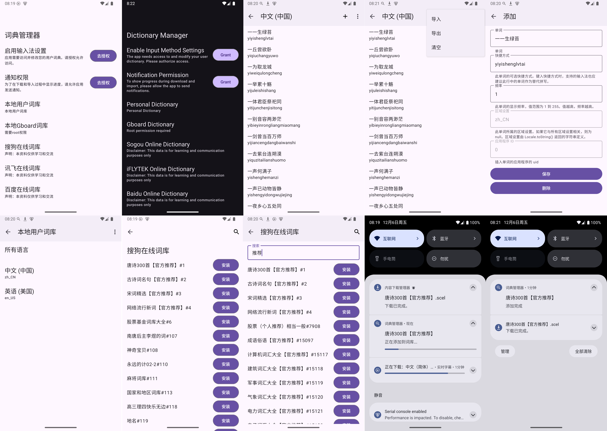

# 词典管理器

一个安卓端的词典管理器应用，支持管理多个来源的词库，包括本地词库和在线词库（如搜狗词库）。

**本项目旨在解决 Gboard 或其他依赖 UserDictionary 的安卓输入法在中文词库匮乏时的问题。**

---

## ✨ 功能

- 📂 管理多个本地词库。
- 🌐 在线词库同步（支持搜狗词库）。
- 🔎 提供搜索、添加、删除词条功能。
- 📚 提供高效的离线词典查询功能。
- 📥 支持自定义词库格式的导入与导出功能。

---

## 🎨 设计规范

- [Google Android 开发规范](https://developer.android.com/docs)
- [Material Design 3 (MD3)](https://m3.material.io/)
- [动态色彩方案](https://developer.android.com/develop/ui/views/theming/dynamic-colors)
- [自适应图标设计](https://developer.android.com/develop/ui/views/launch/icon_design_adaptive)

---

## 📸 截图

---

## 📥 安装

1. 从 [releases 页面](https://github.com/halifox/DictionaryManager/releases) 下载最新的 APK 文件。
2. 在您的设备上启用 “安装来自未知来源的应用”。
3. 点击下载的 APK 文件进行安装。

---

## 🛠️ 使用方法

1. 打开应用后，进入设置，添加本地词库或连接在线词库（如搜狗词库）。
2. 在 **词库管理界面**，可以进行词条的浏览、编辑、删除操作。
3. 使用顶部搜索框，快速查找词汇内容。

---

## 🤝 贡献

我们欢迎任何形式的社区贡献！  
请阅读 [贡献指南 (CONTRIBUTING.md)](CONTRIBUTING.md)，了解如何提交 Issue、请求功能或贡献代码。

---

## 📜 许可证

本项目遵循 [GPL-3.0 License](LICENSE)。

---

## 🙏 致谢

- [Android SDK](https://developer.android.com/studio)
- [搜狗词库](https://pinyin.sogou.com/dict/)
- [sogou_pinyin_dict.list](https://gist.githubusercontent.com/leiless/55eddb489c53500373a5bc46c75afc4b/raw/749f6e86373990f6739c19da33e59e138a2eb089/sogou_pinyin_dict.list)
- [Another SCEL Parser](https://github.com/alswl/ascel)

## 📢 法律声明

本开源项目仅供学习和交流用途。由于可能涉及专利或版权相关内容，请在使用前确保已充分理解相关法律法规。未经授权，**请勿将本工具用于商业用途或进行任何形式的传播**。

本项目的所有代码和相关内容仅供个人技术学习与参考，任何使用产生的法律责任由使用者自行承担。

感谢您的理解与支持。